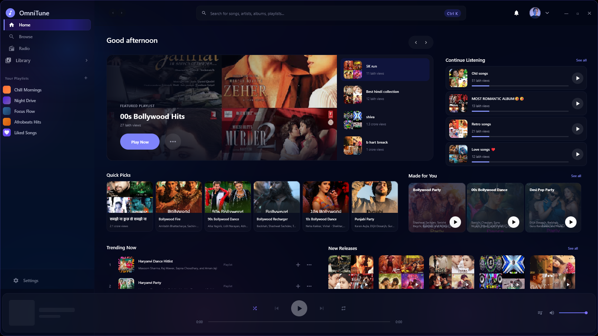
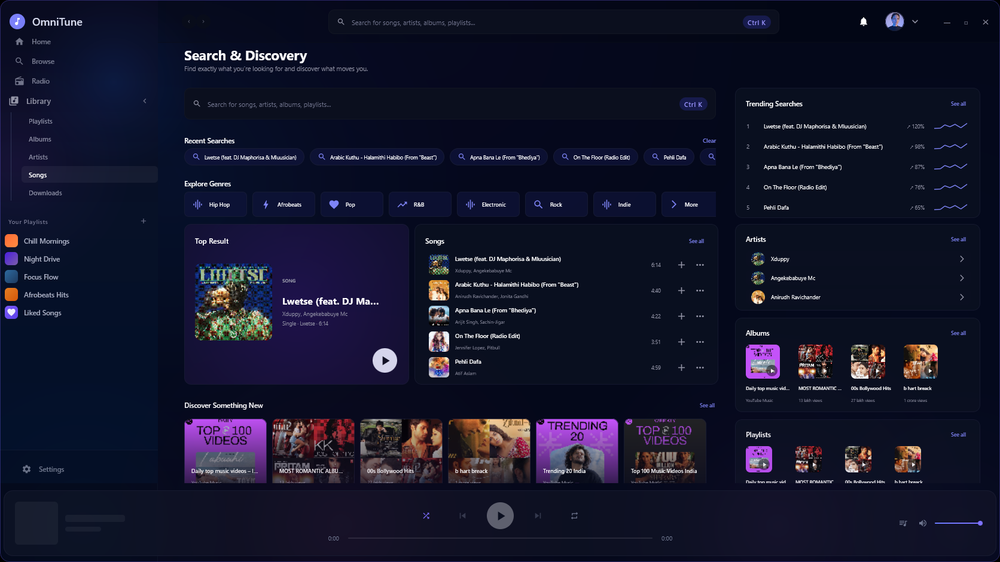
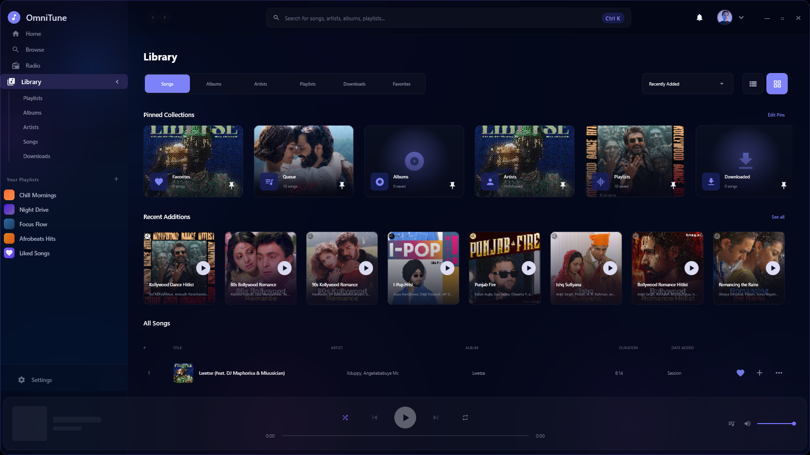
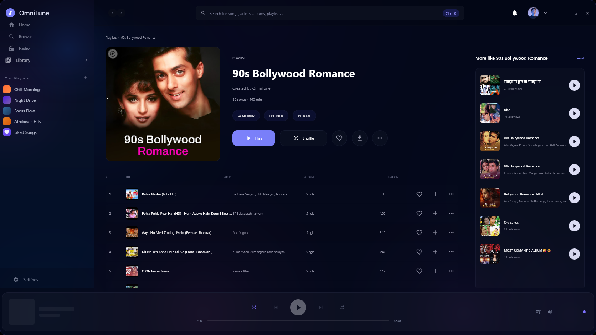
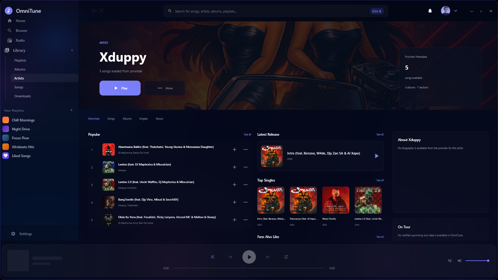
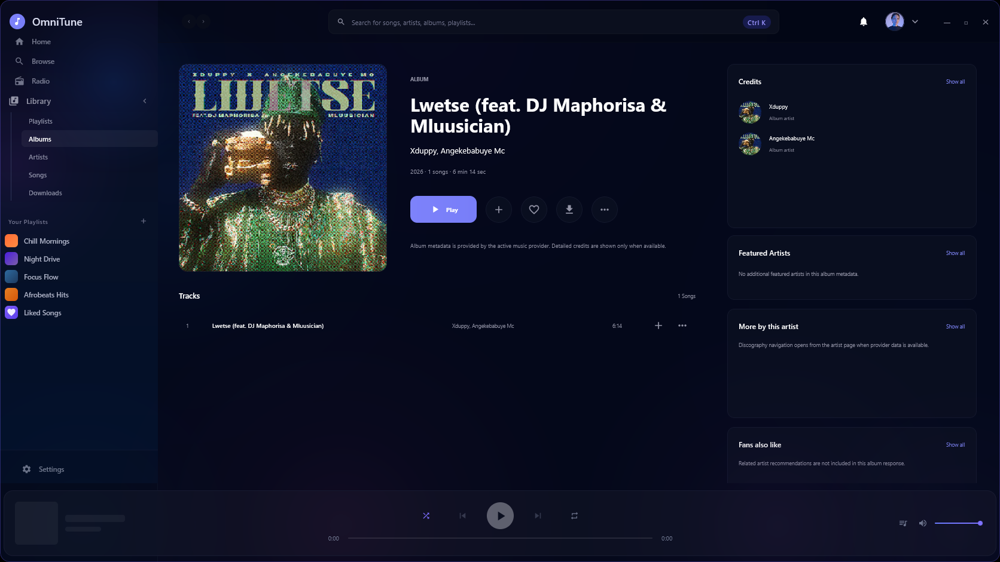
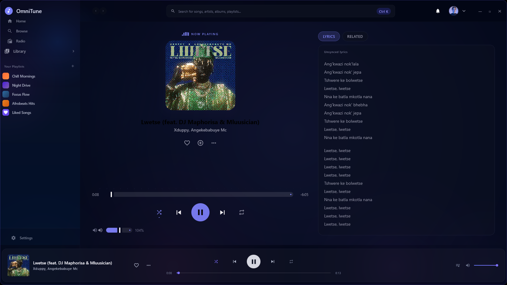
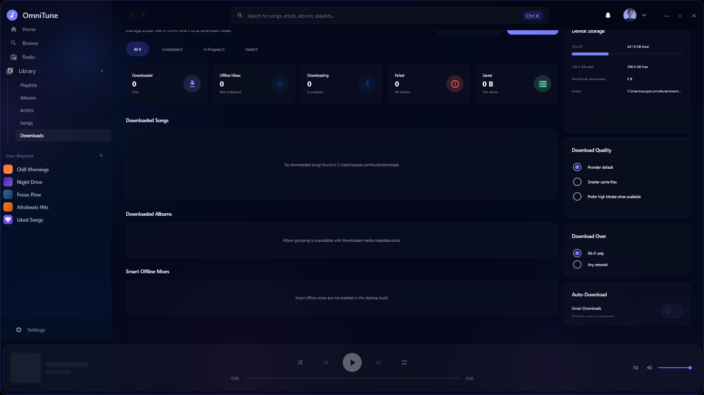

<div align="center">

# OmniTune Windows

A premium music player built exclusively for Windows.

[](https://github.com/soupashh-ship-it/OmniTune-Windows/actions/workflows/ci.yml)



</div>

## Overview

OmniTune Windows is a dedicated desktop music experience built for Windows with Compose Multiplatform Desktop. It combines YouTube Music discovery, playback, queue control, playlists, lyrics, downloads, dynamic presentation themes, and native desktop interaction in a focused Kotlin application.

This repository is the Windows desktop project. It is separate from the Android OmniTune repository.

## Highlights

- YouTube Music search, suggestions, discovery, albums, artists, playlists, and related queues through the included InnerTube client.
- VLC/libVLC-backed playback through `VlcjAudioEngine`, including play, pause, seek, volume, next, previous, shuffle, and repeat.
- Persistent queue-adjacent desktop state, including recent searches, liked song IDs, playback history, playback sessions, saved queue playlists, window size, theme, reduced motion, download quality, and mini-player always-on-top.
- File-backed download manager for provider-backed audio downloads with pause, resume, retry, delete, completed-file validation, and local-file-first playback.
- Now Playing and lyrics surfaces with provider-backed synced/unsynced lyric handling where available.
- Native Windows shell behavior including a custom undecorated window, system tray entry, and mini player.
- Dynamic themes currently represented by Nocturne, Midnight, Dusk, and Aurora.

## Screenshots

| Home | Search |
|---|---|
|  |  |

| Library | Playlist |
|---|---|
|  |  |

| Artist | Album |
|---|---|
|  |  |

| Now Playing | Downloads |
|---|---|
|  |  |

## Current Status

OmniTune Windows is under active development and is not yet a 1.0 release. Core desktop playback, search, queue, settings, download management, and the current visual system are implemented. Final release hardening, installer validation, broader Windows compatibility testing, and distribution signing are still in progress.

The current desktop package version in Gradle is `0.1.1`.

## Technology Stack

- Kotlin `2.1.20`
- Compose Multiplatform `1.8.0`
- Gradle wrapper `8.12`
- JDK `21`
- Koin for dependency injection
- Ktor for network clients
- Coil for artwork loading
- vlcj `4.11.0` with VLC/libVLC for playback
- Java Preferences and local JSON files for desktop persistence

## Installation

A Windows installer release candidate is available on GitHub Releases:

- [OmniTune Windows 0.1.1 RC 1](https://github.com/soupashh-ship-it/OmniTune-Windows/releases/tag/v0.1.1-rc.1)

Download `OmniTune-Setup-0.1.1-windows-x64.exe` from that release for installer testing. The installer is unsigned, so Windows SmartScreen may warn until a signing certificate and reputation are established.

For local release builds, use the validated release wrapper on Windows:

```powershell
.\scripts\release\build-windows-release.ps1
```

Generated release artifacts are written under `build/release/windows/` and should be distributed through GitHub Releases, not committed to Git.

## Build From Source

Prerequisites:

- Windows 10 or Windows 11, x64
- JDK 21
- Git
- VLC 3.x installed at `C:\Program Files\VideoLAN\VLC`, or an equivalent libVLC installation discoverable by JNA/VLCj

Useful commands:

```powershell
.\gradlew.bat --version
.\gradlew.bat tasks --all
.\gradlew.bat :composeApp:desktopTest
.\gradlew.bat build -x :innertube:test
.\gradlew.bat :composeApp:run
.\scripts\release\build-windows-release.ps1
```

The `:innertube:test` task performs a live YouTube Music search and can fail because of network, provider, or regional behavior. It is useful for manual verification but is not treated as the stable CI gate.

## System Requirements

- Windows 10 or newer
- x64 architecture
- JDK 21 for development
- VLC/libVLC available locally for playback and runtime QA involving audio. The app checks a packaged `native/vlc` runtime, `VLC_HOME`, and the standard Windows VLC install path.
- Network access for streaming, search, discovery, lyrics, and provider-backed downloads

## Architecture

See [docs/architecture.md](docs/architecture.md).

At a high level:

- `composeApp` owns the Windows desktop app, UI, player view model, VLC-backed audio engine, settings, and downloads.
- `innertube` provides YouTube Music discovery and playback metadata.
- lyrics and companion service modules are shared JVM modules consumed by the desktop application.
- persistent desktop state is stored with Java Preferences and app-data JSON files.

## Offline Playback

OmniTune Windows includes a file-backed download manager that can persist completed download records and prefer a verified local file before resolving an online stream. Runtime QA evidence exists for local-file playback, but a full internet-disconnected user workflow is still listed as release-hardening work.

## Known Limitations

- Installer output is unsigned, so Windows SmartScreen may warn on local development packages.
- VLC/libVLC discovery checks a packaged `native/vlc` runtime, `VLC_HOME`, and the standard Windows VLC installation path.
- Some provider-backed metadata is unavailable or inconsistent, including album studio credits, artist socials, tour dates, and some account-specific features.
- Network-dependent provider behavior can change outside this repository.
- GitHub release publishing is configured for version tags. The current public artifact is a pre-release RC, not stable 1.0.
- Release packaging uses `packageReleaseExe` and `packageReleaseMsi` through `scripts/release/build-windows-release.ps1`. ProGuard minification is intentionally disabled for the desktop release package because optional transitive desktop dependencies expose unresolved non-runtime references.

## Roadmap

- Validate MSI/EXE installer behavior on clean Windows machines.
- Validate bundled libVLC packaging and redistribution notices.
- Add release signing guidance.
- Expand automated coverage around playback state, queue/session restoration, and download lifecycle behavior.
- Complete manual QA for offline mode with the network disabled.
- Decide and document the first stable release criteria.

## Contributing

See [CONTRIBUTING.md](CONTRIBUTING.md).

## Security

See [SECURITY.md](SECURITY.md).

## License

The source headers in this project declare GPL-3.0 licensing. The repository includes the GPL-3.0 license text in [LICENSE](LICENSE).
