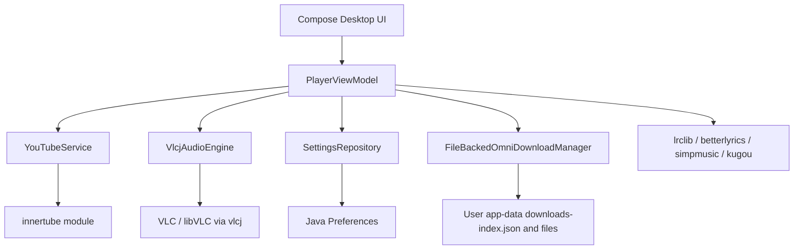

# Architecture

OmniTune Windows is a Kotlin/Compose Multiplatform Desktop application with shared JVM modules for provider, lyrics, and companion-service functionality.

## Modules

- `composeApp`: desktop application entry point, dependency injection, player state, UI, VLC audio, settings, downloads, and packaging.
- `innertube`: YouTube Music client, models, search, browse, player, queue, lyrics endpoint access, and related provider pages.
- `lrclib`, `betterlyrics`, `simpmusic`, `kugou`: lyrics-related support modules.
- `lastfm`: Last.fm API support module.
- `kizzy`: Discord presence support code.
- `canvas`: visual companion module.

## Desktop Entry Point

`composeApp/src/desktopMain/kotlin/com/omnitune/app/Main.kt` starts the Compose Desktop application through `application { ... }`.

It configures:

- libVLC lookup through `NativeRuntime`.
- Koin modules from `initKoin()`.
- the main custom window.
- the mini-player window.
- the system tray menu.
- VLC cleanup on application disposal.

## Dependency Injection

`PlatformModule.kt` wires the desktop runtime:

- `PlatformContext`
- `YouTubeService`
- `SettingsRepository`
- `FileBackedOmniDownloadManager`
- `VlcjAudioEngine`
- `PlayerViewModel`

## Player State

`PlayerViewModel` is the central desktop coordinator. It owns navigation, search state, playlist detail state, current song, stream URL, queue, repeat/shuffle, liked songs, recent searches, saved queue playlists, playback history, playback sessions, download tasks, and lyrics state.

It delegates:

- provider work to `YouTubeService`
- playback to `VlcjAudioEngine`
- persisted settings/history/playlists to `SettingsRepository`
- downloads and local-file detection to `OmniDownloadManager`

## Provider Layer

`YouTubeService` is a coroutine-friendly wrapper around the `innertube` module. It initializes visitor data and exposes search, suggestions, player metadata, home, browse, explore, album, artist, playlist, lyrics, related, and queue calls.

The `innertube` module contains the lower-level request/response models and client behavior.

## Native Runtime

`NativeRuntime` resolves VLC/libVLC from:

- a packaged `native/vlc` directory
- a packaged-parent `native/vlc` directory
- the current working directory
- `VLC_HOME`
- `C:\Program Files\VideoLAN\VLC`

When a runtime is found, it sets `jna.library.path` and `VLC_PLUGIN_PATH` before playback objects are created.

## Audio Layer

`VlcjAudioEngine` wraps vlcj/libVLC and exposes:

- playback state
- position and duration
- error state
- play, pause, resume, stop
- seek and relative seek
- volume and playback rate
- track-finished callback

The current implementation expects VLC/libVLC to be available on Windows through one of the `NativeRuntime` lookup paths.

## Persistence

`SettingsRepository` uses Java Preferences for user-facing desktop state:

- volume
- window size
- recent searches
- liked song IDs
- shuffle and repeat
- appearance theme
- reduced motion
- mini-player always-on-top
- download quality
- saved queue playlists
- playback history
- playback sessions

`PlatformContext` resolves app data under the user home directory by default:

- `.omnitune/`
- `.omnitune/cache/`
- `.omnitune/downloads/`
- `.omnitune/omnitune.db` path placeholder

## Downloads and Offline Playback

`FileBackedOmniDownloadManager` persists download tasks in `downloads-index.json` and stores media files under the app-data downloads directory.

It supports:

- enqueue
- pause
- resume
- retry
- cancel
- delete
- pause all
- resume all
- completed-file validation
- local-file lookup by track ID

`PlayerViewModel` checks for a verified completed local file before resolving an online stream, enabling local-file-first playback for completed downloads.
